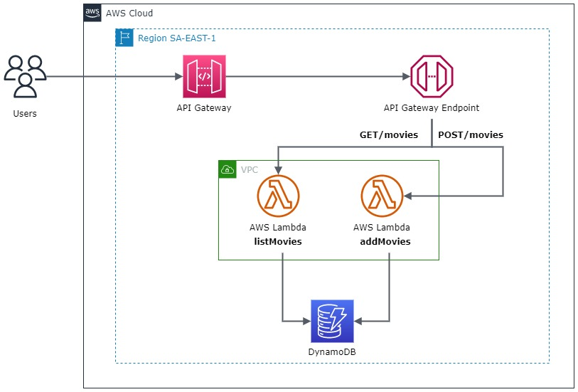

# Quick Start Serverless CRUD

<h1 align="left">
    <a href="https://docs.aws.amazon.com/pt_br/apigateway/latest/developerguide/http-api-dynamo-db.html/"> AWS Serverless CRUD</a>
</h1>

 Quick Start para construir uma API CRUD com o Lambda e o DynamoDB do usuário que para ler, atualizar e excluir itens de uma tabela do DynamoDB.

Quick Starts são implantações de referência automatizadas desenvolvidas que ajudam a implantar serviços e produtos em um provedor de Cloud, visando reduzir centenas de procedimentos manuais a apenas algumas etapas para poder criar e começar a usar seu ambiente em minutos. 

**Visão de Arquitetura**  

### :bookmark_tabs: Pré-requisitos:
- Conta na AWS (https://aws.amazon.com/pt/premiumsupport/knowledge-center/create-and-activate-aws-account/)
- Credenciais configuradas (https://docs.aws.amazon.com/pt_br/cli/latest/userguide/cli-chap-configure.html)
- Git instalado (https://git-scm.com/book/pt-br/v2/Come%C3%A7ando-Instalando-o-Git)
- Terraform instalado (https://learn.hashicorp.com/tutorials/terraform/install-cli?in=terraform/aws-get-started)

### :computer: O que você criará:
<ul>
  <li>API Gateway
     <ul>
      <li>REST API</li>
      <li>Endpoint Regional</li>
    </ul>
  </li>
  <li>Lambda
    <ul>
      <li>listMovie Lambda</li>
      <li>addMovie Lambda</li>
    </ul>
  </li>
  <li>DynamoDB
    <ul>
      <li>table Movie</li>
    </ul>
  </li>
</ul>

### :ocean: Funcionamento:
Quando a API Rest for invocada, o API Gateway encaminha a solicitação para a função do Lambda. A função do Lambda interage com o DynamoDB e retorna uma resposta ao API Gateway. 
O API Gateway retorna uma resposta. :v:

### :toolbox: Tecnologias:
- Python

### :gear: Como implantar:

#### Clone este repositório
$ git clone https://github.com/claudiovanmartins/quickstart-serverless-crud.git

#### Acesse a pasta do projeto no terminal/cmd
$ cd quickstart-serverless-crud

#### Vá para a pasta infra
$ cd infra

#### Inicialize o ambiente com o provider utilizado e baixe todas as dependências
$ terraform init

#### Crie o plano de execução
$ terraform plan

#### Crie os recursos no provider de acordo com o plano de execução
$ terraform plan --auto-approve

#### Os recursos criados serão exibidos nas variáveis de Output:
apigw_rest_api_url = *"https://{restapi_id}.execute-api.{region}.amazonaws.com/{stage_name}/"*  
dynamodb_table_arn = *"arn:aws:dynamodb:region:account-id:table/Movies"*  
lambda_arn = *"arn:partition:service:region:account-id::function:put_movie_lambda"*  

#### Acesse sua conta da AWS e veja os recursos criados.
Acesse em https://aws.amazon.com e teste a implantação.

